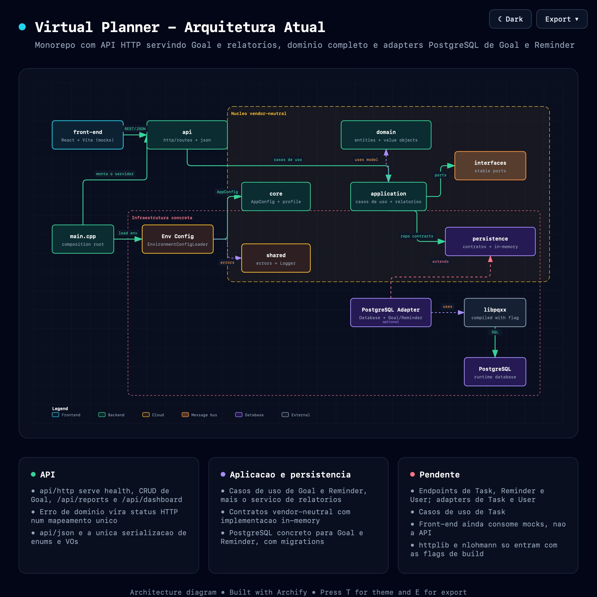

# Virtual Planner

Virtual Planner é um projeto acadêmico desenvolvido em C++20 para ajudar no planejamento pessoal.

O domínio cobre usuários, tarefas, metas e lembretes. Sobre ele já existem casos de uso de Goal e Reminder, um serviço de relatórios, uma API HTTP que serve o CRUD de metas mais relatórios e dashboard, e adapters PostgreSQL para Goal e Reminder. O front-end em React já consome a API nas telas de metas, com tela de login; tarefas e lembretes seguem em mocks, porque ainda não há endpoints para eles.

O build padrão continua sem rede e sem banco: HTTP, JSON, PostgreSQL e cobertura são opções desligadas por padrão.

## Objetivos

- Manter o código simples e organizado.
- Separar as principais partes do sistema.
- Compilar o projeto com CMake e C++20.
- Permitir o uso opcional do PostgreSQL.
- Criar uma base para tarefas, metas e lembretes.
- Manter testes que não dependam de um banco real.

## Tecnologias

- **C++20**: linguagem do backend.
- **CMake 3.20+**: build system, modularizado em `back-end/cmake/`.
- **CTest**: execução da suíte de testes, sem framework externo.
- **cpp-httplib** e **nlohmann/json**: servidor HTTP e serialização, baixados por `FetchContent` apenas com as flags de build ligadas.
- **React 19 + TypeScript + Vite + Tailwind CSS v4**: front-end, em `front-end/`.
- **PostgreSQL**: banco de dados, usado através de um adapter opcional.
- **libpqxx**: cliente C++ do PostgreSQL, exigido apenas quando `VIRTUAL_PLANNER_WITH_POSTGRES=ON`.
- **Docker Compose**: PostgreSQL local para desenvolvimento e testes de integração.
- **GitHub Actions**: CI do backend em `.github/workflows/backend.yml` (build padrão, JSON/HTTP, PostgreSQL e cobertura) e do front-end em `.github/workflows/frontend.yml`.

## Requisitos

- Compilador com suporte a C++20.
- CMake 3.20 ou superior.
- `libpqxx` apenas para usar PostgreSQL.
- Docker opcional.

## Compilação

### Sem PostgreSQL

Esta é a opção padrão:

```bash
cmake -S back-end -B back-end/build
cmake --build back-end/build
```

### Com a API HTTP

O servidor e a serialização JSON dependem de bibliotecas baixadas por `FetchContent`, então ficam atrás de uma opção desligada por padrão — o build padrão nunca toca a rede:

```bash
cmake -S back-end -B back-end/build-http -DVIRTUAL_PLANNER_WITH_HTTP=ON
cmake --build back-end/build-http
```

Para compilar apenas a serialização compartilhada, sem o servidor, use `-DVIRTUAL_PLANNER_WITH_JSON=ON`.

### Com PostgreSQL

É necessário instalar o `libpqxx` antes de compilar:

```bash
cmake -S back-end -B back-end/build-postgres -DVIRTUAL_PLANNER_WITH_POSTGRES=ON
cmake --build back-end/build-postgres
```

No macOS com Homebrew, o `libpq` é keg-only e fica fora do prefixo padrão que o CMake procura. Como o `libpqxx` depende dele, é preciso informar os dois prefixos:

```bash
cmake -S back-end -B back-end/build-postgres -DVIRTUAL_PLANNER_WITH_POSTGRES=ON \
  -DCMAKE_PREFIX_PATH="$(brew --prefix libpqxx);$(brew --prefix libpq)"
```

### Com cobertura de testes

```bash
cmake -S back-end -B back-end/build-coverage -DVIRTUAL_PLANNER_WITH_COVERAGE=ON
cmake --build back-end/build-coverage
ctest --test-dir back-end/build-coverage --output-on-failure
```

O job `Cobertura de testes` do CI publica o percentual no resumo da execução e o relatório HTML como artefato.

## Execução

Sem PostgreSQL:

```bash
./back-end/build/virtual_planner
```

Com PostgreSQL:

```bash
VP_USE_POSTGRES=true ./back-end/build-postgres/virtual_planner
```

No build padrão, sem a opção `VIRTUAL_PLANNER_WITH_HTTP`, o executável imprime a configuração e encerra. Com a API compilada, ele sobe o servidor:

```bash
VP_HTTP_HOST=127.0.0.1 VP_HTTP_PORT=8080 ./back-end/build-http/virtual_planner
curl -s http://127.0.0.1:8080/api/health
```

`VP_HTTP_HOST` e `VP_HTTP_PORT` são opcionais e caem em `0.0.0.0:8080` — dentro de container é o que permite ao Docker publicar a porta; fora dele, prefira `127.0.0.1`. A API sobe e responde mesmo sem PostgreSQL.

Endpoints disponíveis hoje:

| Método e rota | O que faz |
| --- | --- |
| `GET /api/health` | responde sempre 200, e informa se o banco está configurado e conectado |
| `POST /api/auth/register` | cria uma conta; senha com no mínimo 12 caracteres |
| `POST /api/auth/login` | devolve o cookie `vp_session` |
| `POST /api/auth/logout` | invalida a sessão |
| `GET /api/auth/me` | quem está logado |
| `GET /api/goals?period=&date=` | lista metas do período civil (`weekly`, `monthly` ou `yearly`) |
| `GET /api/goals/:id` | busca uma meta |
| `POST /api/goals` | cria uma meta |
| `PATCH /api/goals/:id` | atualização parcial |
| `PATCH /api/goals/:id/status` | altera só o status |
| `DELETE /api/goals/:id` | remove uma meta |
| `GET /api/reports?period=&date=` | métricas do período civil, mesmos valores de `period` |
| `GET /api/dashboard` | resumo do dia |

Erro de domínio vira status HTTP num mapeamento único: `400` para validação, `404` para não encontrado, `409` para conflito e `500` genérico, sem vazar a mensagem interna. O contrato completo, com CORS e log, está em [docs/api.md](docs/api.md).

Os endpoints de Task, Reminder e User ainda não existem.

> **Toda rota exige sessão**, com três exceções: `GET /api/health` e as duas de
> `POST /api/auth/{register,login}`. Sem cookie válido a resposta é `401` —
> inclusive para caminho que não existe, para que ninguém mapeie a API só
> variando o caminho. Cada recurso pertence a um usuário: pedir o de outra
> pessoa responde `404`, e não `403`, porque um `403` confirmaria que aquele
> identificador existe.
>
> Ainda assim, mantenha `VP_HTTP_HOST` em `127.0.0.1` fora de container. Não
> existe HTTPS aqui, e sem ele o cookie de sessão trafega em texto claro.

## Configuração do PostgreSQL

As configurações são feitas por variáveis de ambiente:

- `POSTGRES_HOST`: padrão `localhost`.
- `POSTGRES_PORT`: padrão `5432`.
- `POSTGRES_DB`: nome do banco.
- `POSTGRES_USER`: usuário.
- `POSTGRES_PASSWORD`: senha.
- `POSTGRES_SSLMODE`: padrão `disable`.

## Variáveis De Ambiente

Existe um `.env.example` por workspace, cada um com um escopo:

| Arquivo | Alimenta | Contém |
| --- | --- | --- |
| `.env.example` (raiz) | `docker-compose.yml` | `POSTGRES_DB`, `POSTGRES_USER`, `POSTGRES_PASSWORD` — os três valores que **criam** o banco no container |
| `back-end/.env.example` | o executável do backend e `scripts/db-migrate.sh` | `VP_*` (nome, perfil, host e porta HTTP) e `POSTGRES_*` — em qual banco **conectar** |
| `front-end/.env.example` | o build do Vite | `VITE_API_URL` — a base da API. O `.env.development`, versionado, já traz `/api` para o `npm run dev` funcionar sem passo manual |

`POSTGRES_DB`, `POSTGRES_USER` e `POSTGRES_PASSWORD` aparecem em dois arquivos de propósito — criar o banco e conectar nele são coisas diferentes. Se mudar de um lado, mude do outro.

Copie o `.env.example` de cada workspace para `.env` no mesmo diretório e ajuste os valores. Nenhum `.env` vai para o Git: o `.gitignore` ignora `.env` e `.env.*`, com exceção explícita para `.env.example`.

Tudo com o prefixo `VITE_` é embutido no bundle e fica visível no navegador. Nunca coloque senha ou token em `front-end/.env`.

## Docker

### Stack completa

`POSTGRES_PASSWORD` é obrigatória e não tem valor padrão: sem ela o compose para
com erro em vez de subir com uma senha publicada neste repositório. De um clone
limpo:

```bash
cp .env.example .env    # e troque POSTGRES_PASSWORD
docker compose up
```

| Serviço | Porta | O que é |
| --- | --- | --- |
| `postgres` | 5432 | PostgreSQL 16 |
| `migrate` | — | roda `scripts/db-migrate.sh` uma vez e sai |
| `api` | 8080 | backend com HTTP e PostgreSQL compilados |
| `web` | 8081 | build de produção do frontend servido por nginx |

Depois de subir:

```bash
curl -s http://127.0.0.1:8080/api/health   # {"status":"ok", ...}
open http://127.0.0.1:8081                 # frontend
```

A ordem é garantida por `depends_on` com condição: a API só sobe depois que o banco está saudável **e** as migrações terminaram, e o frontend só depois que a API responde `/api/health`. O `migrate` é idempotente, então repetir `docker compose up` não reaplica nada.

O healthcheck da API confere o campo `status` da resposta, não só o código HTTP — `/api/health` responde 200 mesmo com o banco fora do ar, então checar só o status HTTP não provaria integração.

**Primeiro build demora** (alguns minutos): a imagem do backend parte do `ubuntu:24.04` e compila o `libpqxx` 8.x a partir do código-fonte, porque a distribuição empacota a 7.x e o adapter usa a API 8.x. Os builds seguintes reaproveitam a camada.

### Só o banco

Para desenvolver com o backend rodando na máquina:

```bash
docker compose up -d postgres
```

### Comandos úteis

```bash
docker compose ps
docker compose logs -f api
docker compose stop
docker compose down
```

Use `docker compose down -v` somente para apagar também os dados locais.

Todas as portas são publicadas em `127.0.0.1`, e não em `0.0.0.0`: nem o banco nem
a API ficam alcançáveis de outra máquina. Os serviços conversam entre si pela rede
interna do compose, pelo nome do serviço, então nada disso depende da publicação.

### Credenciais

Nenhuma credencial vai para dentro das imagens. Tudo entra por variável de ambiente do compose.

`POSTGRES_PASSWORD` não tem valor padrão em lugar nenhum — nem no compose, nem no `.env.example`, nem no `scripts/db-migrate.sh`. O placeholder do `.env.example` é `DEFINA-UMA-SENHA`, escolhido justamente por **não** funcionar: um placeholder que conecta é pior que nenhum, porque quem esquece de trocá-lo não descobre.

Com `VP_PROFILE=production` a aplicação recusa subir se a senha for um valor conhecido (`change-me`, `postgres`, `password`...) ou se `POSTGRES_SSLMODE` for `disable`.

## Migrações Do Banco De Dados

Com o PostgreSQL de pé (`docker compose up -d postgres`), aplique as migrações de `back-end/migrations/` com:

```bash
./scripts/db-migrate.sh
```

O script é idempotente (não reaplica migrações já registradas), roda cada migração em transação e usa as mesmas variáveis de ambiente de `back-end/.env.example` (`POSTGRES_HOST`, `POSTGRES_PORT`, `POSTGRES_DB`, `POSTGRES_USER`, `POSTGRES_PASSWORD`, `POSTGRES_SSLMODE`). Veja `back-end/migrations/README.md` para detalhes.

## Tutorial: back-end e front-end juntos

Do clone até usar o aplicativo no navegador, com os dados no PostgreSQL. Foi
executado de verdade nesta ordem — as saídas abaixo são as reais.

Há dois caminhos. O primeiro é um comando; o segundo é o do dia a dia, com
recompilação e hot reload.

### Caminho A — tudo pelo Docker

```bash
cp .env.example .env    # e troque POSTGRES_PASSWORD
docker compose up
```

Sobe banco, migrações, API e front-end na ordem certa. Quando parar de rolar
log, abra <http://127.0.0.1:8081>, crie a conta na tela de login e use.

Não há nada a configurar: o build do `web` recebe `VITE_API_URL=/api` e o nginx
faz o proxy para o serviço `api`. **O primeiro build demora alguns minutos**,
porque a imagem do backend compila o `libpqxx` a partir do código-fonte.

### Caminho B — desenvolvimento, com hot reload

Quatro terminais, ou três se o banco já estiver de pé.

**1. Banco**

```bash
cp .env.example .env    # e troque POSTGRES_PASSWORD
docker compose up -d postgres
```

**2. Migrações**

```bash
set -a && source .env && set +a
export POSTGRES_HOST=127.0.0.1
./scripts/db-migrate.sh
```

```
Concluído: 7 migration(ns) aplicada(s), 0 pulada(s).
```

Rodar de novo é seguro: as já aplicadas aparecem como puladas. É este passo que
cria a coluna `goals.user_id`, sem a qual nenhuma consulta funciona.

**3. Back-end**

```bash
cmake -S back-end -B back-end/build-full \
  -DVIRTUAL_PLANNER_WITH_POSTGRES=ON \
  -DVIRTUAL_PLANNER_WITH_HTTP=ON
cmake --build back-end/build-full

VP_USE_POSTGRES=true VP_HTTP_HOST=127.0.0.1 VP_HTTP_PORT=8080 \
  ./back-end/build-full/virtual_planner
```

No macOS com Homebrew, o `libpq` é keg-only e o CMake não o encontra sozinho.
Acrescente ao primeiro comando:

```bash
-DCMAKE_PREFIX_PATH="$(brew --prefix libpqxx);$(brew --prefix libpq)"
```

Confirme que a API subiu **e** enxergou o banco:

```bash
curl -s http://127.0.0.1:8080/api/health
```

```json
{"app":"virtual-planner","database":{"configured":true,"connected":true},
 "profile":"development","status":"ok"}
```

`"connected": false` significa API de pé e banco fora do alcance — confira
`POSTGRES_HOST` e se o container está rodando.

**4. Front-end**

```bash
cd front-end
npm ci
npm run dev
```

Nada a configurar: `.env.development` é versionado com `VITE_API_URL=/api`, e o
`vite.config.ts` encaminha `/api` para `http://127.0.0.1:8080`.

### Usando

Abra <http://localhost:5173>. Você cai na tela de login, porque nenhuma rota
renderiza sem sessão.

1. Clique em **Ainda não tenho conta**.
2. Preencha nome, e-mail e uma senha de **no mínimo 12 caracteres** — menos que
   isso o servidor recusa.
3. **Criar conta e entrar** leva ao dashboard.
4. Em **Metas**, crie uma meta. Ela vai para o PostgreSQL.

A prova de que atravessou tudo:

```bash
docker compose exec postgres \
  psql -U "$POSTGRES_USER" -d "$POSTGRES_DB" \
  -c "SELECT id, user_id, description, status FROM goals ORDER BY id;"
```

```
 id | user_id | description |   status
----+---------+-------------+-------------
  1 |       1 | Estudar C++ | In Progress
```

O caminho completo é: navegador → proxy do Vite → API em C++ → `libpqxx` →
PostgreSQL. A coluna `user_id` mostra o dono; **toda consulta do adapter filtra
por ela**, então outra conta não enxerga esta linha.

### O que funciona, e o que ainda não

| Tela | Origem dos dados |
| --- | --- |
| Login, Metas, Relatórios, Dashboard | **API e PostgreSQL** |
| Tarefas, Lembretes, Perfil | mocks — não existem endpoints para elas |

Detalhes e o que falta para fechar estão em
[O que falta para funcionar por completo](#o-que-falta-para-funcionar-por-completo).

### Erros comuns

| Sintoma | Causa |
| --- | --- |
| Cai no login e volta ao login | senha com menos de 12 caracteres; a mensagem aparece no formulário |
| Tela "A API não respondeu" | back-end fora do ar, ou em porta diferente de 8080 — ajuste com `VP_API_TARGET` |
| Metas vazias após reiniciar a API | a conta sumiu junto: `User` só existe em memória. Crie de novo |
| `"connected": false` no health | banco fora do alcance; confira `POSTGRES_HOST` e o container |
| `relation "goals" does not exist` | faltou rodar `./scripts/db-migrate.sh` |
| `ports are not available: 5432` | já há um PostgreSQL na máquina ocupando a porta |
| Telas com dados que não estão no banco | `VITE_API_URL` comentada: o front está em modo mock |

Para trabalhar sem back-end nenhum, comente `VITE_API_URL` em
`front-end/.env.development` — todas as telas voltam aos mocks.

## Tutorial: consumindo os dados do banco pela API

Este é o aprofundamento do anterior, **sem o front-end**: só `curl`, `psql` e o
repositório em C++. Serve para entender o contrato da API, depurar um endpoint
ou escrever código de back-end.

Se você quer o aplicativo funcionando, use o
[tutorial de back-end e front-end juntos](#tutorial-back-end-e-front-end-juntos).

Todos os comandos abaixo foram executados de verdade — as respostas são as
reais, não ilustrativas.

### O que persiste, e o que não persiste

Antes de começar, uma ressalva que evita meia hora de confusão:

| Dado | Onde vive |
| --- | --- |
| `Goal` | PostgreSQL, tabela `goals` |
| `Reminder` | PostgreSQL, tabela `reminders` |
| `Task` | apenas em memória — não há adapter PostgreSQL |
| `User` e sessões | apenas em memória — não há adapter PostgreSQL |

**Reiniciar o processo apaga as contas**, mesmo com `VP_USE_POSTGRES=true`. As
metas continuam no banco, mas você precisa registrar o usuário de novo — e o
`user_id` novo pode não bater com o das metas antigas. É limitação conhecida:
falta o adapter de `User` e a migration da coluna de senha.

### 1. Suba o banco

```bash
cp .env.example .env    # e troque POSTGRES_PASSWORD
docker compose up -d postgres
```

`POSTGRES_PASSWORD` não tem valor padrão: sem ela o compose para com erro, em
vez de subir com uma senha publicada neste repositório.

### 2. Aplique as migrações

```bash
set -a && source .env && set +a
export POSTGRES_HOST=127.0.0.1
./scripts/db-migrate.sh
```

O script é idempotente: rodar duas vezes não reaplica nada. É ele que cria a
coluna `goals.user_id`, sem a qual nenhuma consulta funciona.

### 3. Compile com PostgreSQL e HTTP

```bash
cmake -S back-end -B back-end/build-full \
  -DVIRTUAL_PLANNER_WITH_POSTGRES=ON \
  -DVIRTUAL_PLANNER_WITH_HTTP=ON
cmake --build back-end/build-full
```

No macOS com Homebrew, acrescente
`-DCMAKE_PREFIX_PATH="$(brew --prefix libpqxx);$(brew --prefix libpq)"`.

### 4. Suba a API apontando para o banco

```bash
VP_USE_POSTGRES=true VP_HTTP_HOST=127.0.0.1 VP_HTTP_PORT=8080 \
  ./back-end/build-full/virtual_planner
```

Em outro terminal, confirme que a API subiu **e** enxergou o banco:

```bash
curl -s http://127.0.0.1:8080/api/health
```

```json
{"app":"virtual-planner","database":{"configured":true,"connected":true},
 "profile":"development","status":"ok"}
```

Se vier `"connected":false`, a API está de pé mas o banco não respondeu —
confira `POSTGRES_HOST` e se o container está rodando. O `status` fica
`degraded` nesse caso.

### 5. Crie uma conta e entre

Sem sessão, tudo responde `401`:

```bash
curl -s -o /dev/null -w "%{http_code}\n" \
  "http://127.0.0.1:8080/api/goals?period=weekly&date=2026-08-05"
```

```
401
```

> As aspas em volta da URL não são decorativas: sem elas o `zsh` tenta expandir
> o `?` como glob e o comando falha antes de sair da máquina.

Registre e faça login guardando o cookie num arquivo (`-c` grava, `-b` envia):

```bash
curl -s -X POST http://127.0.0.1:8080/api/auth/register \
  -H 'Content-Type: application/json' \
  -d '{"name":"Alice","email":"alice@example.com","password":"uma-senha-de-verdade"}'
```

```json
{"email":"alice@example.com","id":1}
```

```bash
curl -s -c cookies.txt -X POST http://127.0.0.1:8080/api/auth/login \
  -H 'Content-Type: application/json' \
  -d '{"email":"alice@example.com","password":"uma-senha-de-verdade"}'
```

Responde `204` e grava `vp_session` em `cookies.txt`. A senha exige no mínimo
12 caracteres; menos que isso responde `400`:

```json
{"error":{"code":"validation_error","message":"Password must contain at least 12 characters."}}
```

### 6. Grave e leia dados

Todas as chamadas a seguir usam `-b cookies.txt`.

**Criar** — responde `201`, com `Location` apontando para o recurso:

```bash
curl -s -b cookies.txt -X POST http://127.0.0.1:8080/api/goals \
  -H 'Content-Type: application/json' \
  -d '{"description":"Estudar C++","category":"Study",
       "period":"Weekly","reference_date":"2026-08-05"}'
```

```json
{"category":"Study","description":"Estudar C++","id":1,"period":"Weekly",
 "reference_date":"2026-08-05","status":"In Progress"}
```

**Listar por período** — `period` aceita `weekly`, `monthly` ou `yearly`, e
`date` é a data de referência que define o intervalo:

```bash
curl -s -b cookies.txt \
  "http://127.0.0.1:8080/api/goals?period=weekly&date=2026-08-05"
```

```json
[{"category":"Study","description":"Estudar C++","id":1,"period":"Weekly",
  "reference_date":"2026-08-05","status":"In Progress"}]
```

**Alterar o status** — endpoint próprio, separado da atualização de dados:

```bash
curl -s -b cookies.txt -X PATCH http://127.0.0.1:8080/api/goals/1/status \
  -H 'Content-Type: application/json' -d '{"status":"Completed"}'
```

**Relatório do período** — agrega só o que é seu:

```bash
curl -s -b cookies.txt \
  "http://127.0.0.1:8080/api/reports?period=weekly&date=2026-08-05"
```

```json
{"start_date":"2026-08-03","end_date":"2026-08-09","goals_total":1,
 "goals_completed":1,"goals_ratio":1.0,"productivity_index":1.0,
 "goal_categories":[{"label":"Study","ratio":1.0,"score":1.0,"total":1}], ...}
```

A meta concluída no passo anterior aparece aqui: `goals_completed` foi a 1 e a
razão fechou em `1.0`. `start_date` e `end_date` mostram que a semana ISO de
`2026-08-05` vai de segunda a domingo.

Razão com denominador zero vem como `null`, e nunca `0`. A distinção importa:
`null` é "não há o que medir", `0.0` é "havia o que medir e não foi feito".

### 7. Confira direto no banco

É aqui que se prova que o dado atravessou a aplicação e chegou ao PostgreSQL:

```bash
docker compose exec postgres \
  psql -U "$POSTGRES_USER" -d "$POSTGRES_DB" \
  -c "SELECT id, user_id, description, status, reference_date FROM goals ORDER BY id;"
```

```
 id | user_id |  description  |  status   | reference_date
----+---------+---------------+-----------+----------------
  1 |       1 | Estudar C++   | Completed | 2026-08-05
```

A coluna `user_id` é o ponto: **toda consulta do adapter filtra por ela**. Um
`SELECT` sem esse filtro, feito à mão, enxerga as linhas de todo mundo — o
isolamento vive na aplicação, não em RLS do PostgreSQL.

### 8. O isolamento na prática

Registre um segundo usuário e repita as leituras com o cookie dele:

```bash
curl -s -X POST http://127.0.0.1:8080/api/auth/register \
  -H 'Content-Type: application/json' \
  -d '{"name":"Bob","email":"bob@example.com","password":"outra-senha-boa-123"}'
curl -s -c bob.txt -X POST http://127.0.0.1:8080/api/auth/login \
  -H 'Content-Type: application/json' \
  -d '{"email":"bob@example.com","password":"outra-senha-boa-123"}'
```

| O que Bob faz | Resposta |
| --- | --- |
| `GET /api/goals/1` (a meta da Alice) | `404` |
| `GET /api/goals?period=weekly&date=...` | `[]` |
| `GET /api/reports?...` | `goals_total: 0`, `goals_ratio: null` |

O `404` é deliberado: um `403` diria a Bob que aquele identificador existe.

### Erros comuns

| Sintoma | Causa provável |
| --- | --- |
| `401` em tudo | falta `-b cookies.txt`, ou a sessão morreu com o restart |
| `"connected":false` no health | `POSTGRES_HOST` errado, ou container fora do ar |
| `no matches found` no shell | URL com `?` sem aspas, no `zsh` |
| `400 validation_error` no registro | senha com menos de 12 caracteres |
| `relation "goals" does not exist` | faltou rodar `./scripts/db-migrate.sh` |
| Conta some após reiniciar | esperado: `User` só existe em memória |

### Consumindo pelo código, sem HTTP

Quem escreve backend não passa pela API: usa o repositório direto. O contrato
exige o dono na assinatura, então não há como esquecer de filtrar.

```cpp
#include "virtual_planner/infrastructure/postgres/postgres_goal_repository.hpp"

infrastructure::postgres::PostgresGoalRepository goals{database};

// O dono é obrigatório: sem ele isto não compila.
const auto minhas = goals.find_by_date_range(
    domain::Date{3, 8, 2026}, domain::Date{9, 8, 2026}, user_id);

const auto uma = goals.find_by_id(1, user_id);  // nullopt se for de outro dono
```

Trocar PostgreSQL por `InMemoryGoalRepository` não muda uma linha de quem chama:
ambos implementam `persistence::GoalRepository`. É o que permite a suíte de
testes rodar sem banco nenhum.

## Testes

Testes padrão:

```bash
ctest --test-dir back-end/build --output-on-failure
```

Teste de integração com PostgreSQL:

```bash
ctest --test-dir back-end/build-postgres --output-on-failure -R postgres_integration_test
```

O teste de integração precisa das variáveis `POSTGRES_DB`, `POSTGRES_USER` e `POSTGRES_PASSWORD`, e do schema aplicado via `./scripts/db-migrate.sh`.

## Estrutura do Projeto

```text
.
├── back-end
│   ├── include/virtual_planner
│   │   ├── api
│   │   │   ├── http
│   │   │   │   └── routes        # uma unidade por grupo de endpoints
│   │   │   └── json
│   │   ├── application
│   │   │   ├── goal
│   │   │   ├── reminder
│   │   │   └── reporting
│   │   ├── core
│   │   ├── domain
│   │   │   ├── entities
│   │   │   ├── enums
│   │   │   └── value_objects
│   │   ├── infrastructure
│   │   │   ├── config
│   │   │   ├── logging
│   │   │   └── postgres
│   │   ├── interfaces
│   │   ├── persistence
│   │   │   └── memory           # repositorios in-memory
│   │   └── shared
│   ├── src
│   ├── tests                    # unit/ e integration/
│   ├── cmake                    # sources/ e tests/, um arquivo por modulo
│   ├── migrations
│   ├── Dockerfile
│   ├── .env.example
│   └── CMakeLists.txt
├── front-end
│   ├── src
│   ├── Dockerfile
│   ├── nginx.conf
│   └── package.json
├── scripts
│   └── db-migrate.sh
├── docs
│   └── diagrams
├── .github/workflows
├── docker-compose.yml
└── README.md
```

## Arquitetura

O projeto está dividido em camadas:

- `domain`: entidades e regras do sistema.
- `application`: casos de uso e serviços. Goal está completo (criar, buscar, atualizar, remover, listar e alterar status), Reminder tem criação, atualização, remoção e listagem com recorrência, e `reporting` calcula as métricas do contrato da P-63. Task ainda não tem casos de uso.
- `api`: fronteira HTTP e serialização JSON. Depende das camadas internas, mas nenhuma delas depende de `api` — `httplib` e `nlohmann` só aparecem aqui.
- `interfaces`: contratos usados pelas diferentes partes do projeto.
- `persistence`: contratos para banco de dados e repositórios.
- `infrastructure`: implementações externas, como configuração e PostgreSQL.
- `core` e `shared`: configurações, erros e recursos compartilhados.
- `infrastructure/logging`: `ConsoleLogger`, adapter da porta `Logger`.
- `main.cpp`: inicia e configura a aplicação.

O código principal não depende diretamente do PostgreSQL. A implementação do banco fica em `infrastructure/postgres`.



Outros arquivos do diagrama:

- [`docs/diagrams/current-architecture.html`](docs/diagrams/current-architecture.html)
- [`docs/diagrams/current-architecture.architecture.json`](docs/diagrams/current-architecture.architecture.json)

### Contratos De Persistência

- `persistence::Database`: abstração de ciclo de vida de persistência, independente de fornecedor.
- `persistence::Transaction`: contrato mínimo para `commit()` e `rollback()`.
- `persistence::*Repository`: contratos de repositório para as entidades de domínio. Todos têm implementação in-memory em `persistence/memory`. `GoalRepository` e `ReminderRepository` já possuem adapter PostgreSQL; `TaskRepository` e `UserRepository` seguem só com in-memory.
- `infrastructure::postgres::PostgresConfig`: configuração externa da conexão PostgreSQL.
- `infrastructure::postgres::PostgresDatabase`: adapter concreto baseado em `libpqxx`, compilado apenas com `VIRTUAL_PLANNER_WITH_POSTGRES=ON`.
- `infrastructure::postgres::PostgresTransaction`: transação PostgreSQL com rollback automático no destrutor se não houver `commit()`.
- `infrastructure::postgres::PostgresGoalRepository` e `PostgresReminderRepository`: implementações concretas sobre `libpqxx`.

## Domínio Inicial

O projeto possui as seguintes entidades:

- `User`
- `Task`
- `Goal`
- `Reminder`

Também possui tipos auxiliares para datas, horários, categorias, prioridades e status:

- Value objects: `Date` e `TimeSlot`, com contrato público congelado pela P-61.
- Enums: `Category`, `Priority`, `TaskStatus`, `GoalStatus`, `GoalPeriod`, `ReminderType`, `ReminderRecurrence` e `Shift`.

`Shift` não é campo de nenhuma entidade: o turno de uma tarefa é **derivado** de `TimeSlot::start()`, conforme decidido em [`docs/reporting-metrics-contract.md`](docs/reporting-metrics-contract.md).

## Documentação

Documentos adicionais estão disponíveis na pasta `docs/`:

- [`docs/getting-started.md`](docs/getting-started.md): primeiros passos.
- [`docs/architecture.md`](docs/architecture.md): decisões de arquitetura.
- [`docs/conventions.md`](docs/conventions.md): convenções de código, testes e build.
- [`docs/persistence-architecture.md`](docs/persistence-architecture.md): camada de persistência.
- [`docs/postgresql.md`](docs/postgresql.md): uso do PostgreSQL.
- [`docs/postgresql-integration-report.md`](docs/postgresql-integration-report.md): relatório da integração com PostgreSQL.
- [`docs/api.md`](docs/api.md): contrato JSON, endpoints, erros, CORS e log.
- [`docs/date-timeslot-contract.md`](docs/date-timeslot-contract.md): contrato público congelado de `Date` e `TimeSlot`.
- [`docs/reporting-metrics-data.md`](docs/reporting-metrics-data.md): dados necessários e casos de teste das métricas de relatório.
- [`docs/reporting-metrics-contract.md`](docs/reporting-metrics-contract.md): fórmulas e contrato das métricas de relatório.
- [`back-end/migrations/README.md`](back-end/migrations/README.md): convenção de numeração das migrações.

O planejamento e o estado das tarefas ficam nas issues do GitHub, não neste arquivo.

## 🖥️ Front-end (Interface do Usuário)

O front-end do Virtual Planner foi construído com **React 19, TypeScript, Vite e Tailwind CSS v4**. As telas de metas consomem a API; tarefas e lembretes ainda leem os mocks de `front-end/src/mocks`, porque não existem endpoints para eles.

As rotas ficam em `src/App.tsx`, dentro de um `AppShell` com sidebar e alternância de tema:

| Rota | Tela |
| --- | --- |
| `/` | dashboard |
| `/tasks`, `/tasks/new`, `/tasks/:id/edit` | tarefas |
| `/planner` | quadro semanal |
| `/goals`, `/goals/new`, `/goals/:id/edit` | metas |
| `/reminders`, `/reminders/new`, `/reminders/:id/edit` | lembretes |
| `/reports` | painel analítico |
| `/profile`, `/settings` | perfil e ajustes |
| `/login` | entrada e criação de conta, fora do `AppShell` |

### Como rodar o front-end localmente

```bash
cd front-end
npm ci
npm run dev
```

`npm ci` instala exatamente o que está em `package-lock.json` — use `npm install` só quando a intenção for alterar dependências.

### Scripts

| Comando | O que faz |
| --- | --- |
| `npm run dev` | Servidor de desenvolvimento do Vite, com hot reload |
| `npm run build` | `tsc -b` seguido do build de produção do Vite |
| `npm run lint` | ESLint sobre todo o workspace |
| `npm run preview` | Serve localmente o resultado de `npm run build` |

### Integração contínua

`.github/workflows/frontend.yml` roda em Node 22 a cada push em `main` e a cada pull request que toque `front-end/**`, executando `npm ci`, `npm run build` e `npm run lint`. Rode os três localmente antes de abrir PR: o job falha no primeiro erro de tipo ou de lint.

### Front-end ligado à API

**Já vem configurado.** Não há passo manual: `front-end/.env.development` é
versionado com `VITE_API_URL=/api`, o `vite.config.ts` faz proxy de `/api` para
`http://127.0.0.1:8080`, e o `docker compose` passa a mesma coisa para o build
do `web`, com o nginx fazendo o proxy.

Com o backend de pé, basta:

```bash
cd front-end
npm ci
npm run dev
```

A tela de login aparece, você cria a conta ali mesmo e cai no dashboard. As
telas de **metas** leem e gravam no backend de verdade.

Para trabalhar sem backend, comente `VITE_API_URL` em `.env.development` e tudo
volta aos mocks.

#### Por que o caminho é relativo, e não a URL do backend

O cookie de sessão é `SameSite=Strict`: o navegador só o envia em requisição do
mesmo site. Apontando `VITE_API_URL` para `http://127.0.0.1:8080` a partir de
`localhost:5173`, o login responde `204` e **todas** as chamadas seguintes
voltam `401`, porque o cookie fica para trás. O proxy elimina isso ao deixar
front e backend na mesma origem. Para mudar o alvo do proxy, use
`VP_API_TARGET`.

#### Como está montado

```text
front-end/src
├── lib/api
│   ├── config.ts             # lê VITE_API_URL e decide backend ou mock
│   ├── httpClient.ts         # fetch com credentials; erro da API vira ApiError
│   ├── goalsApi.ts           # endpoints de Goal
│   ├── authApi.ts            # register, login, logout
│   ├── session.ts            # quem está logado, via GET /api/auth/me
│   └── virtualPlannerApi.ts  # fachada: roteia Goal, mantém o resto em mock
├── components/RequireSession.tsx   # guarda: sem sessão, manda para /login
└── pages/LoginPage.tsx             # login e criação de conta
```

Não há token em `localStorage` de propósito: a sessão é um cookie `HttpOnly`
que o JavaScript não lê, e é isso que impede um XSS de roubá-la.

### O que falta para funcionar por completo

O caminho de **metas** funciona ponta a ponta hoje: criar conta, entrar, criar,
listar, editar, mudar status, excluir e ver relatórios — tudo no PostgreSQL.

O que ainda **não** funciona, e por quê:

| Falta | Bloqueio | Efeito hoje |
| --- | --- | --- |
| Telas de **tarefas** lerem o backend | não existem endpoints de `Task` | a tela funciona, mas sobre mocks |
| Telas de **lembretes** lerem o backend | não existem endpoints de `Reminder` | idem |
| **Contas sobreviverem a um restart** | não existe `PostgresUserRepository` | ao reiniciar a API, é preciso criar a conta de novo |
| Tela de **perfil** mostrar dados reais | não existem endpoints de `User` | mocks |

As três primeiras linhas têm a mesma causa: **só `Goal` tem endpoints**. Quando
`Task` e `Reminder` ganharem os deles, ligar as telas é acrescentar um arquivo
em `src/lib/api/` e trocar o roteamento em `virtualPlannerApi.ts` — a decisão
está num lugar só justamente por isso.

A conta que some no restart é a mais incômoda no dia a dia: as metas continuam
no banco, mas o `user_id` de uma conta nova pode não bater com o das metas
antigas. Resolve com uma migration da coluna de senha (faixa 050–059) e o
adapter de `User`.

### Estrutura

```text
front-end/src
├── components   # componentes reutilizáveis de UI
├── pages        # telas, uma por rota
├── lib          # helpers sem JSX
├── mocks        # dados de exemplo enquanto a API não é consumida
├── types        # tipos compartilhados entre telas
└── assets       # imagens e estáticos
```

As convenções de front-end estão em [AGENTS.md](AGENTS.md#agent-especialista-frontend--react--typescript) e em [front-end/README.md](front-end/README.md).
